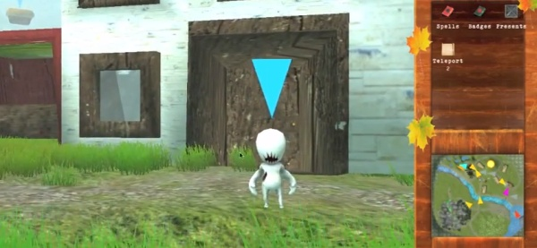

CodeSpells is a game I'm producing.  It's about being a wizard.  Here's the main website: [codespells.org](http://codespells.org).

Here's a teaser video we made when we released our wizard soccer arena:

[plugin:youtube](https://www.youtube.com/watch?v=_vrXXkuOjlo)
 

Honestly, you should leave this site now and go play the game.  It'll be a lot more fun than reading this post about the game.

Seriously, get out of here and play it.

Go away.  I don't like you.

It looks like you're still here.  Fine.  I shall now do my best to bore you with some history.

I coded the first version of CodeSpells in 2012.  It sucked.  Crappy graphics.  Crappy gameplay.  And a crappy in-game Java IDE.  It also had creepy aliens for some reason:

For some reason [the press loved it](http://www.wired.co.uk/article/codespells).  I really don't know why we got so much coverage.  Maybe the creepy aliens had something to do with it?

Actually, I do know why.  It was because it was "science".  I was a gradaute student and [I wrote science papers](/projects/phd) about CodeSpells.  Stuff from scientific journals always seems to find its way into mainstream news -- especially when it deals with mainstream topics like video games.

Anyway, I hated this prototype.  I always felt that I could do better.  Looking back at it reminds me of a time when I was a less talented game designer.

I'm happy to say all that's left of this prototype are some screenshots, some old news articles, and [some research papers](/projects/phd).

In 2014, I launched [a kickstarter](https://www.kickstarter.com/projects/thoughtstem/codespells-express-yourself-with-magic) to build a new version.  I asked for $50,000.  We got $164,014 -- enough to fund the project for about two years. 

CodeSpells has been in a playable state on Steam Early Access for much of that time.  As a business person, my philosophy is to release products ASAP and iterate.  Having a real community helps inform how to design games.

Our alpha and beta testers have written thousands of spells, all of which are available in-game.  If you so desired, you could write spells and publish them for other users too.  Sounds fun right?  It almost makes me wonder why you're still here.

Did I mention you should get out of here and [go buy it](http://codespells.org)?  You could be a wizard with just a few clicks...

By the way, I was kidding back there when I said I don't like you.  Thanks for reading.
